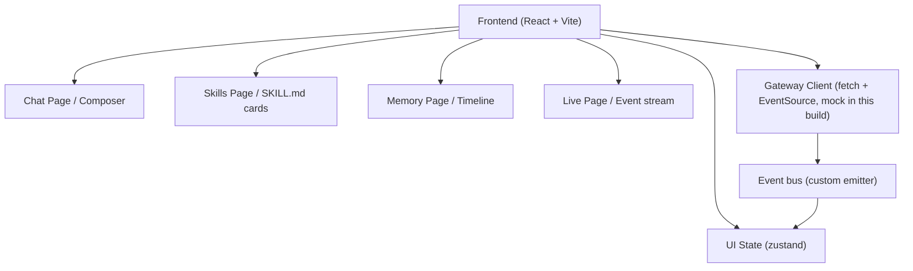
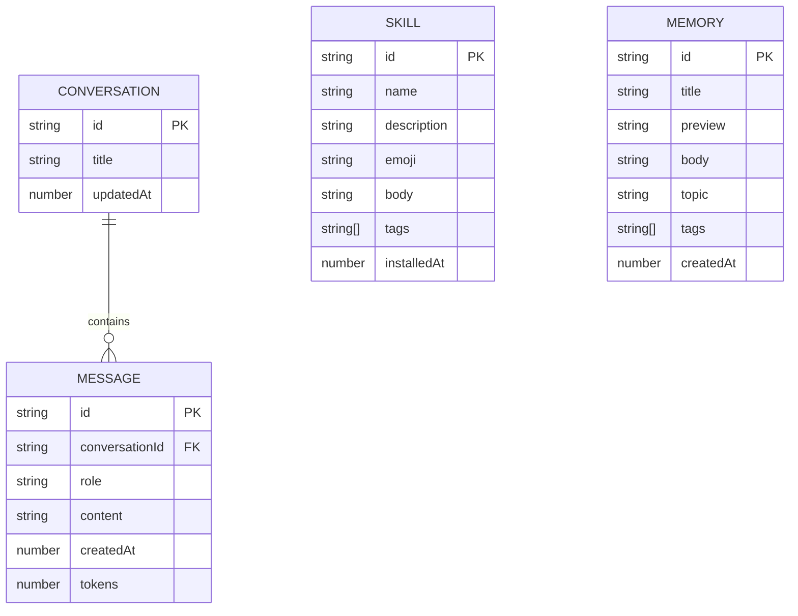

# OpenClaw Control UI — Technical Architecture

## 1. Architecture Design



## 2. Technology Description

- **Frontend**: React@18 + TypeScript, Vite build, Tailwind CSS@3 with design tokens via CSS
  variables, Zustand for client state
- **Markdown rendering**: `react-markdown` + `remark-gfm`
- **Icons**: `lucide-react`
- **No backend in this build** — all data is generated by a client-side mock Gateway that
  simulates the agent event stream. The Gateway client is a small abstraction (a few helper
  functions) so a real EventSource-based backend can be swapped in later.
- **No database** — conversation and memory entries live in a zustand store backed by
  `localStorage` for persistence across reloads.

## 3. Route Definitions

| Route | Purpose |
|-------|---------|
| `/` | Chat page (default) |
| `/chat/:conversationId` | Chat page, scoped to a specific conversation |
| `/skills` | Installed skills grid |
| `/skills/:skillId` | Skill detail drawer (also accessible via grid) |
| `/memory` | Memory timeline + topic cloud |
| `/live` | Live event stream |

Client-side routing with `react-router-dom`. The `skills/:skillId` route opens the drawer
on top of the grid.

## 4. API Definitions

There is no real backend in this initial build. Instead, a typed `GatewayClient` module
exposes the following functions, which the UI calls:

```ts
type Role = "user" | "agent" | "system" | "tool";

type ChatMessage = {
  id: string;
  role: Role;
  content: string;
  createdAt: number;
  tokens?: number;
};

type GatewayEvent =
  | { type: "thinking"; at: number; text: string }
  | { type: "text"; at: number; delta: string }
  | { type: "tool.call"; at: number; tool: string; payload: Record<string, unknown> }
  | { type: "tool.result"; at: number; tool: string; ok: boolean; payload: Record<string, unknown> }
  | { type: "error"; at: number; message: string };

type SkillCard = {
  id: string;
  name: string;
  description: string;
  emoji: string;
  tags: string[];
  body: string;
  installedAt: number;
};

type MemoryEntry = {
  id: string;
  title: string;
  preview: string;
  body: string;
  tags: string[];
  topic: string;
  createdAt: number;
};

declare const gateway: {
  sendMessage(conversationId: string, text: string): AsyncIterable<GatewayEvent>;
  listConversations(): Promise<{ id: string; title: string; updatedAt: number }[]>;
  listSkills(): Promise<SkillCard[]>;
  listMemory(): Promise<MemoryEntry[]>;
  version(): string;
};
```

A real backend swap-out would implement the same interface against a `/v1/events` SSE
endpoint, `/v1/skills`, etc. The UI does not need to change.

## 5. Server Architecture Diagram (if backend exists)

Not applicable for this frontend-only build.

## 6. Data Model (client-only)

### 6.1 Data Model Definition



Physical foreign keys are not used; references are logical and application-enforced.

### 6.2 Persistence Strategy

All stores write to `localStorage` under a single key: `openclaw-ui-state-v1`. On initial
load, seeded fixtures are injected for skills, memory, and a couple of sample conversations,
so the UI never looks empty on first use. The Live page has no persistence — events are
ephemeral and expire when the page unmounts.

### 6.3 Code Organization

```
src/
  App.tsx                    ── routing shell + header
  main.tsx                   ── React bootstrap
  index.css                  ── Tailwind + design tokens + grain
  components/
    Chat/
      ConversationPane.tsx   ── scrollable bubbles
      Composer.tsx           ── textarea + send + command palette
      SidebarHistory.tsx     ── nav: conversation list
    Skills/
      SkillGrid.tsx          ── card grid
      SkillCard.tsx          ── individual card
      SkillDrawer.tsx        ── slide-in markdown details
    Memory/
      MemoryTimeline.tsx     ── timeline rail
      TopicCloud.tsx         ── pill cloud
    Live/
      EventStream.tsx        ── real-time events
      EventRow.tsx           ── per-event row with collapsible JSON
    Shell/
      Header.tsx             ── wordmark, status dot, nav
      StatusDot.tsx          ── small indicator
  pages/
    ChatPage.tsx
    SkillsPage.tsx
    MemoryPage.tsx
    LivePage.tsx
  store/
    chat.ts                  ── zustand messages + conversations
    skills.ts                ── skills list
    memory.ts                ── memory entries
    live.ts                  ── event stream
    ui.ts                    ── nav, drawer state, theme
  gateway/
    client.ts                ── typed GatewayClient mock
    fixtures.ts              ── seed data
  hooks/
    useStream.ts             ── async-iterable → state
  utils/
    format.ts                ── time formatting, color helpers
    markdown.ts              ── markdown options
```

Each component aims to stay under ~200 lines; shared logic is pushed to hooks or utils.
