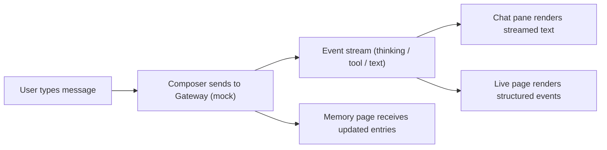

# OpenClaw Control UI — Product Requirements Document (PRD)

## 1. Product Overview

OpenClaw Control UI is the desktop-optimized front-end for the OpenClaw personal AI assistant.
It lets users converse with their agent, inspect skills installed on the local Gateway, browse
agent memory, and watch the live thinking/tool stream. The product targets power users of
OpenClaw who want something more engaging than a Telegram chat window — a dashboard that
feels like a well-tuned ops center for their AI.

- Target users: OpenClaw self-hosters, power users curious about what the agent is doing
- Core problems: opaque tool calls, no centralized skill browser, missing a branded feel
- Market value: becomes the canonical "Control UI" that ships with the open source agent

## 2. Core Features

### 2.1 User Roles

| Role | Registration Method | Core Permissions |
|------|---------------------|------------------|
| Local User | None — direct client access | Chat, install skills, view memory |

### 2.2 Feature Module

1. **Chat page**: hero conversation pane, live-streamed agent replies, role-chip indicators,
   command palette (`/`), multi-line input, conversation history in sidebar.
2. **Skills page**: grid of installed skills (SKILL.md cards), metadata chips, install/remove
   placeholders, search.
3. **Memory page**: timeline of agent memory entries, topic clusters, search, per-entry detail
   drawer.
4. **Live page**: structured event stream — reasoning blocks, tool calls, tool results, errors —
   with per-event timestamps, source (model / channel), and collapsible JSON payloads.
5. **Shell**: branded header with version, live status dot (connected / thinking / idle), quick
   navigation.

### 2.3 Page Details

| Page Name | Module Name | Feature description |
|-----------|-------------|---------------------|
| Chat | Conversation pane | Streaming render, markdown, inline code blocks with copy button, user/agent bubbles on opposite sides, typing indicator, message timestamp, failed-message retry |
| Chat | Sidebar history | Conversation list, "New chat", search filter, active chat highlight |
| Chat | Input composer | Multi-line textarea, Enter-to-send / Shift+Enter-for-newline, `/` command palette, attachments placeholder |
| Skills | Skill grid | Cards pulled from local skills directory, emoji badge, title, one-line description, tag chips, hover reveal for details |
| Skills | Detail drawer | Full SKILL.md body, commands section, limitations, installation notes |
| Memory | Timeline | Vertical timeline grouped by date, entry cards with tags, content preview, expand to full entry |
| Memory | Topic cloud | Prominent topic labels rendered as soft rounded chips; clicking filters timeline |
| Live | Event stream | Rich vertical stream of events: `thinking`, `tool.call`, `tool.result`, `error`, `message.sent`; color-coded; JSON payload collapsible; timestamp millisecond precision |
| Shell | Header | Logo wordmark, version badge, connection status dot, page nav |

## 3. Core Process

1. User opens the UI and lands on the Chat page.
2. User types a message, presses Enter.
3. Input travels to the local Gateway (mocked in this frontend version), which streams back
   events (`thinking`, `tool.call`, `tool.result`, `text`) that the Live page visualizes in
   real-time.
4. Agent reply appears word-by-word in the Chat pane; tokens animate in with a slight
   delay-based stagger.
5. User can navigate to Skills to browse installed SKILL.md cards, or to Memory to review
   what the agent remembers, or to Live to debug the latest call.

## 4. User Interface Design

### 4.1 Design Style

- **Primary color**: a warm "claw" orange, `#FF7A1A`, with a deep slate base (`#0B0D10`)
- **Secondary color**: a muted teal, `#1AB6A8`, used for tool/result callouts and "OK" states
- **Background**: near-black gradient with a very subtle grain texture — feels premium, never
  flat
- **Typography**: editorial serif display (`Fraunces`) for the brand wordmark and hero
  message headers; a clean geometric sans (`Space Grotesk`) for body and labels
- **Button style**: soft rounded rectangle (`rounded-lg`), faint inner glow on hover, 2px ring
  with the primary color when focused
- **Card style**: translucent panels with a hairline 1px border, subtle gradient along the
  top edge, soft shadow on hover
- **Layout style**: three-column shell — left 260px (nav + context), middle (main content,
  flex), right 380px (Live stream, always visible on desktop)
- **Animation emphasis**: staggered entry on page load (cards pop in with 40ms offsets),
  streamed text reveal (opacity 0→1, slight vertical shift), pulsing "thinking" indicator
  while tokens are arriving
- **Icons**: Lucide, outlined style, uniform 20px canvas

### 4.2 Page Design Overview

| Page Name | Module Name | UI Elements |
|-----------|-------------|-------------|
| Chat | Conversation pane | Gradient back, pill-style bubbles, timestamp caption, inline code with line numbers, hover actions (copy / retry) |
| Chat | Sidebar history | Compact list, thin scrollbar, search box at top with a magnifier icon |
| Chat | Input composer | Floating composer at bottom, rounded-full with a focus ring, growing textarea, send button on right, `/` hint ghosted in placeholder |
| Skills | Grid | 3-up auto-grid, cards equal-height, aspect-ratio preserved, hover reveals the full SKILL.md one-liner |
| Skills | Detail drawer | Right-side slide-in, soft backdrop blur, markdown rendering of SKILL.md body, close (X) top-right |
| Memory | Timeline | Vertical rail with dots, each entry a card with date chip and tag chips, staggered animation on mount |
| Memory | Topic cloud | Wrap row of pills, variable size based on count, larger pills use accent color |
| Live | Event stream | Color-coded events (amber for thinking, teal for tool, muted gray for result), collapsible JSON, thin hairline separators |
| Shell | Header | Wordmark "OpenClaw" in serif + orange dot, small version chip, nav items use underline-on-active |

### 4.3 Responsiveness

- Desktop-first; three-column layout at `>= 1280px`
- At `>= 1024px` and `< 1280px`, Live column collapses into a toggleable drawer
- At `< 1024px`, only the main content is visible; sidebar nav becomes a hamburger menu,
  Live becomes a floating sheet at the bottom

### 4.4 3D Scene Guidance

Not applicable. No 3D rendering is planned for this release.
